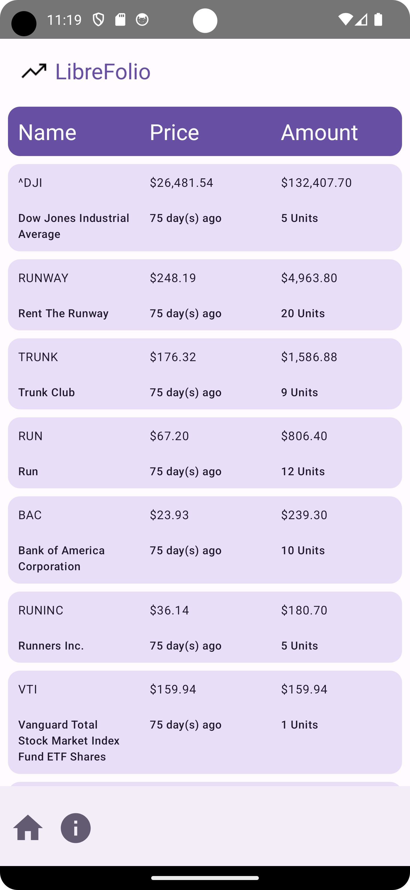

# LibreFolio

An open portfolio app, created for my interview take-home assignment.

# Implementation notes
- Only USD is supported.
- Primary key is the list index, so paginating downloads would not work unless we used ticker, or some other unique id.
- [AutoValueGson](https://github.com/rharter/auto-value-gson) could be used to clean up parsing logic, but was skipped to avoid a third-party library
- Changing between test endpoints currently requires rebuilding the entire app
- URL is not obfuscated, which may be sensitive data (exposing what company is conducting this interview) - I have also uploaded it to GitHub publicly to enable Actions/auto-building, but I can privatize the repo on request. I have not mentioned the company explicitly in this repo.
- List is currently only updated when the app is reopened. This makes sense as the list is essentially static currently.
- String formatting is somewhat hardcoded and may lack RTL language support. We only support English translations currently.
- Content descriptions/other accessibility concerns have not been widely implemented.
- Not all UX components react to screen size, for simplicity. The stocks data does as it's the largest text to display.
- Paging is not handled, as the network call is non-paging.
- The equities list is currently sorted by amount descending. This cannot be changed by the user in the current version.

# Write Up

- Compiled with Android Studio Flamingo, 2022.2.1 Patch 2. Test by installing the provided apk on your phone.
- Focus areas: I mostly focused on the internal data flow, using Jetpack Compose/ViewModel/RoomDB/Retrofit and asynchronous Flows to separate the network call, persistence, and UI layers. The UI should be responsive despite Network/Persistence calls. Most importantly, the persistence layer, which adds overhead, is important for the UX to work when switching between malformed/empty endpoints. I wanted my app to be as extensible as possible without being overkill for the current prompt. This is almost the exact effort I would apply given the same production task at Amazon, based on experience. I spent less time working on the UX itself, which is pretty basic.
- Trade offs: In many places I kept the architecture simpler than a production version might be, for time constraints, and since the prompt is simple. For example:
  - Abstracting out EquityCardData business logic to a Composable-free class would make non-instrumentation-testing possible. The logic is pretty thin so I kept it as is, as it's mostly UI-related logic.
  - Many places where another module could have been created to avoid construction logic inline have been avoided for simplicity. For example, in EquityCardData the current time is requested inline, which means each card will have a different current time, and also testing this case is difficult without something like a CurrentTimeGetter.
  - I'm overloading the main ViewModel to perform the network call and persist, then retrieve the persisted data. This could be abstracted into another coroutine scope for example, for just the network->persistence connection. Using ViewModel scope for everything is simple for the current use case.
- I believe the project demonstrates my knowledge of current Android best practices, such as using Hilt for dependency injection and thus enabling test-driven development, and Jetpack Compose/ViewModel/RoomDB/Retrofit, etc. I learned much of this while working at Amazon over the last 5 or so years. I tested almost every line of business logic, outside of UX, and ran linting, to demonstrate an actual code review revision.
- Build.gradle shows the dependencies, all of which are fairly standard. I did not copy any "third-party" logic. Includes: JetPack Compose, Coroutines, Retrofit, GSON, Room, Hilt, Navigation, Material3, Robolectric, Mockk, and others.
- I spent a lot longer than expected, but mostly in research to prepare for the pair programming interview. Actual coding time was probably ~1 business day, split across the week evenly. Without intending to appear like https://github.com/EnterpriseQualityCoding/FizzBuzzEnterpriseEdition, I did intend to put the same effort I would put into a similar project at Amazon, ready for use by a large team in production.